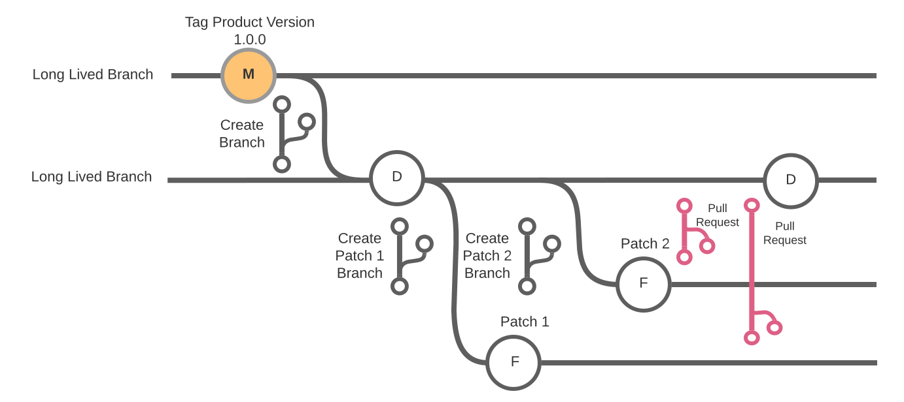

# Configuration Management for

# Clinical Ancillary Product Line 

## VistA MUMPS Code

VistA MUMPS Code starts with the platinum version of code.

This becomes the  Main branch
This branch should be tagged according to the [Semantic Versioning](https://semver.org/) standard as well as tagged with a MUMPS Identifier (Keith?)


## Branches

--- Describe what a branch is ---

### Main - Long Lived

Created from the Gold version of the product

### Dev - Long Lived

Branch from Main

### Patch - Short Lived

Branch from Dev; Named according to the Patch being worked on using the "Patch-*" convention

Created as needed and deleted when finished

When Patch is committed back to Dev it should be tagged with an [annotated tag](#tags) 

### Hot Fix - Short Lived

Branch from Dev; Named according to the defect being addressed using the "Fix-*" convention where the JIRA Tag for the defect is part of the name (e.g. Fix-1356)

### Pre-Prod - Short Lived

Branch from Dev after Patch has been merged back into Dev

Used for Final IOC testing


---

Protect the branches - Settings; Branches; 
Default branch should be production branch
Branch Protection Rules
Require PR Reviews before merging
Dismiss stale pull request approval when new commits are pushed
Establish status checks then require status checks to pass before merge
Include Administrators
wild card rule for branches with a name pattern
release-* <-- Any branch starting with "release-"
Manage Access; 

---


## Commits

*Commit often, push to origin regularly (ideally at the end of every day)*

Commits save changes to the local repository after the changes have been staged. In order to save the changes a commit message needs to be added to describe the changes made.

When using the Git command line tool to add a commit message use the `-m` option.

Commit messages can be as simple as one line, or as complex as necessary with a subject line giving a high level overview of what is being committed

```
$ git commit -m "Derezz the master control program"
```

If subject and body are needed (highly recommended):

```
$ git commit
```

Git will launch the default text editor (which can be set by the `git config --global` command)

Every commit must contain a commit message which corresponds to the good commit guidelines specified for the team.

### Good Commit Message Guidelines

Commit messages should be clear and meaningful.

A well-crafted Git commit message is the best way to communicate context about a change to other developers working on that project.

Commit messages can adequately communicate why a change was made, and understanding that makes development and collaboration more efficient.

Properly written commit messages can significantly help to analyze the history of changes to the code.

[Bad commit](https://medium.com/better-programming/stop-writing-bad-commit-messages-8df79517177d) messages can confuse and obfuscate changes made that other developers or auditors may not be able to understand when reviewing code history.

- Every commit message should have 3 parts:
  - Subject - Describe the commit in a short imperative tense sentence fragment (followed by a blank line)
  - Body - More detailed description of the commit which can be multiple paragraphs and include standard markdown (if the commit is small enough the body may not be needed as the subject should be informative enough)
  - Closing - Additional useful meta-data (JIRA ticket numbers, additional reference links, additional developers information)
- Specify the type of commit using a Standard Terminology for the subject line


| First Word | Meaning                                              |
| ---------- | ---------------------------------------------------- |
| Add        | Create a capability e.g. Patch, test, dependency.    |
| Bump       | Increase the version of something e.g. dependency.   |
| Chore      | Regular code maintenance                             |
| Cut        | Remove a capability e.g. Patch, test, dependency.    |
| Docs       | Anything related to documentation                    |
| Patch      | Anew Patch being added to a particular application   |
| Fix        | Fix an issue e.g. bug, typo, accident, misstatement. |
| Make       | Change the build process, or tooling, or infra.      |
| Optimize   | Refactor of performance, e.g. speed up code.         |
| Refactor   | A code change that MUST be just a refactoring.       |
| Reformat   | Refactor of formatting, e.g. omit whitespace.        |
| Start      | Begin doing something; e.g. create a Patch flag.     |
| Stop       | End doing something; e.g. remove a Patch flag.       |
| Style      | Patch and updates related to styling                 |
| Test       | Anything related to testing                          |

- Subject lines must never contain (and / or start with) anything that is unique to the application or system (that goes in the body of the commit message.)
- Do not end the subject line with a period
- Capitalize the subject line and each paragraph

- Separate individual paragraphs in the body with a blank line
- Bullet points can be used in the body (a hyphen or asterisk preceded by a single space and blank lines in between bullet points)
- Commit message should not contain any whitespace errors
- Remove unnecessary punctuation marks
- Use the imperative mood in the subject line (think of the subject line as the completion of the following sentence: *"If applied, this commit will..."*)
- Use the body to explain what changes you have made and why you made them

- Do not assume the reviewer understands what the original problem was, ensure you add it

- Do not think your code is self-explanatory

- Issue/JIRA tracking references should be put at the bottom of the commit body


| First Word | Meaning                                                      |
| ---------- | ------------------------------------------------------------ |
| Resolves   | Issue # referenced has been fixed by developer               |
| Closes     | Issue # referenced her been confirmed fixed by QA            |
| See Also   | Issue #'s referenced refer to other issues this commit addresses |

Sample commit message with subject and body:

```
Derezz the master control program

 - MCP (Master Control Program) has been derezzing other programs
 
 - MCP has been usurping system resources and denying user requests
 
MCP turned out to be evil and had become intent on world domination.
This commit throws Tron's disc into MCP (causing its deresolution)
and turns it back into a chess game.

Resolves: #123
Closes: #1570
See also: #456, #789
```

---


  ## Tags

A tag is a way to mark a point in time in the repository. Typically tags are used to mark a release version of the repository. [Tags are not the same as branches](https://en.wikibooks.org/wiki/Git/Advanced#:~:text=The%20difference%20between%20tags%20and,and%20usually%20not%20be%20changed).

While there are 2 types of tags (lightweight and annotated), annotated tags should always be used. Lightweight tags simply list the [semantic version](https://semver.org/) of the release (or in the case of VistA a tag can be the VistA Patch #), while annotated tags give not only the version of the release but also who created the tag, when it was created (which may or may not be the same person/date of the branch it's pointing to) and any message (similar to a commit message) the tagger attributed to the tag. For more information on Git Tagging, check out the [Git Basics Tagging](https://git-scm.com/book/en/Git-Basics-Tagging) page.

giving a high level overview of what is being committed (Patch # and Test Version #)

```
$ git tag -a DG-5.3-342-V4 -m "Both DG-5.3-342 and XYZ-1-100 are mutually dependent upon each other"
```

If no message is specified for an annotated tag:

```
$ git tag -a DG-5.3-342-V4 -m
```

 then Git will launch the default text editor (which can be set by the `git config --global` command). 

```
$ git tag -a XYZ-1-100-V1 -m "Both DG-5.3-342 and XYZ-1-100 are mutually dependent upon each other"
```


## VistA/MUMPS Development Process examples

In working on a single patch the **lead developer** should create a stub patch in FORUM (See: National Patch Module Guide for details) which provides the Patch # to be used.

- Updating the defects status of the appropriate problem ticket(s) in JIRA (or project tracker of choice).

A Patch branch from the current Dev branch and named according to convention (*Patch-\**) using the Patch # generated by NPM (National Patch Module). 

Developers can then checkout that Patch branch to their local development environments *(Question: What IDE's are common for current developers. Should we reference the most common ones and docs on how to do a checkout/check in for those IDE's)* and proceed with their normal development process. 

Exporting of the source from the developer's VistA environment into external files for inclusion into a Git repository and performing regular commits (see [Good Commit Guidelines](#Commit Guidelines)) back to their local branch should be performed and a push back to the GitHub repository should be done on a daily basis at minimum. 

Once development of the components of the patch have been completed, a KIDS build needs to be generated and exported and added to the local Patch branch. 

The developer should complete the Primary Developer Review Checklist (PDRC) and include this in the test folder in the Patch branch of the local repository. If appropriate the Secondary Developer Review Checklist (SDRC) should be completed and added to the test folder as well.

At this point the Patch branch should be tagged with an annotated tag (see [Tags](#tags)), containing the Patch # and Test Version # 

```
$ git tag -a DG-5.3-342-V1 -m "Add first test version of this patch"
```


Patch-tracking message (See: National Patch Module Guide for details) sending the message on FORUM to test sites and the appropriate Product Support Release Coordinator. (*Should Patch-tracking message be stored in GitHub?*)

VistA SQA Checklist completed for each test version


Release Coordinator (RC) has the role of Verifier and is responsible for merging back into Main


and the code is ready for SQA testing, 


In committing the addition of the KIDS build to the local Patch also tag the commit with an annotated tag which should include the Patch Number as well as the Test Version (see [Tags](#tags)).

Once committed and pushed to the GitHub repository, a Pull Request should be made to merge the current changes into the Dev branch. Once the changes have been merged into Dev the code should be sent to FORUM for testing by SQA.


## Misc

Then a new  Dev branch is created by the development team leader with a tag specific to the JIRA Story/Defect

The development team leader should also monitor the Main branch for any changes made by other development teams and pull any changes down to the Dev branch and inform the rest of the team of the changes.


From the new  Dev branch a   Patch/Fix branch is created and tagged according to the JIRA task #

Developers working on the Patch should clone the repository and make any necessary code changes in their local development environment. Committing and pushing those changes up to the repository on a daily basis. 

Developers must also monitor the Patch/Fix branch prior to pushing code up (fortunately git will warn of any changes in the branch you're trying to push to) for any changes made by an upstream branch by another team.

Once the Patch/Fix branch changes have been made and tested any changes made to the  Main branch should be pulled down to the Patch/Fix branch and retested.

Once the code is ready for testing it should be pushed into FORUM by the development team leader from the Dev branch. At the same time an SQA branch is created from the Dev branch and tagged with the test version of the code and the current Main branch semantic version.


If, during SQA testing any defects are discovered a new tag must be added to the Patch/Fix branch for the JIRA Task # assigned to the defect. Once the defect is fixed a new pull request is issued up to the Dev branch, and the changes are pushed to and merged into the existing SQA branch for testing as well

A KIDS build based on the Dev branch is loaded into FORUM.


Once SQA has given final approval of the Patch/Fix, a new Release branch is created from the Dev branch. The code is pulled from FORUM for PreProd/IOC testing and when approved a pull request is issued from the Release branch back into the Main branch.

Pull request reviewed by Dev team and Application Coordinator.


Upon successful release the Dev, Patch/Fix, SQA, and Release branches are deleted from the repository


**Pull:** Pull changes from an upstream repository into your own local repository

**Pull Request:** is a request for an upstream repository to pull changes from your repository into that upstream repository


KIDS build:

routines

Create a MD file for each task, outlining what the task is, who is responsible for each component (e.g. Testing, Pull Requests from each branch, etc see the )


https://github.com/department-of-veterans-affairs/va-mobile-app

https://github.com/department-of-veterans-affairs/va.gov-team/tree/master/products/va-mobile-app

https://gist.github.com/PurpleBooth/b24679402957c63ec426

https://github.com/nasa/openmct/blob/master/CONTRIBUTING.md

https://www.contributor-covenant.org/version/1/4/code-of-conduct/

https://gist.github.com/allthedoll/76b36afa687b2e0a424a7851919830b8 - Readme template


-------------------------------------------------

1. Start with "main" - "gold" instance
2. Long duration "Dev" tagged with 

## Current VistA Development Process

This is the series of steps I have taken in the past. Please note that it might be that GitHub is a straightforward replacement for Rational in these steps, but I’m not entirely sure; we’ll need to discuss it after you’ve had time to consume this tome:

1. As a developer on a new project, I am given access to several VistA instances for development:
   *(The names in parentheses are the namespaces we used for the VSR project.)*

A “gold” instance for use in comparing to the  development instance. (PATVEE) - **GitHub Main Branch**


1. 1. A main development instance (“main”) where I make my changes. (MNTVBB) - **GitHub Patch Branch** - Branched off of "Dev" branch and given name "Feat-\*"  (e.g. Feat-DG-5.3-964)

   2. Developer would check out this branch into their development environment

   3. Do dev work and commit/push changes regularly with commit messages

      When ready for SQA Testing, create a build via KIDS - 

      **Export KIDS build into flat file** with new **test version number**

      Add the KIDS build Export to the Patch Branch and commit back to Dev with an annotated tag briefly what this build is for

      Commit comment should be brief about the changes made in this commit:

  Load Build into FORUM
  Send to SQA

   


   Example 2: also needs merging

   **Example 3: Two patches from different packages must be installed together for both to function properly.**
   If two patches have to be installed together, create them in a combined build. For example XYZ-1-100 and DG-5.3-342 are mutually dependent upon each other. Each would be in it's own Patch Branch (Patch 1 and Patch 2 in the diagram below). Which would need to be merged as part of SQA prior to testing.

   NOTE: Combined builds should be used judiciously. Combining multiple patches that depend on one specific patch but not on each other may create risks in testing and deployment. When doing a combined build, consultation with the ***Release Coordinator*** is required. If uncertain, consultation with a ***package expert*** is warranted.

   Gold version is all packages




Patch 1 branch devs work on package DG (Registration name space)

Patch 2 branch devs work on package XU (Kernel Name space)

As each patch is developed in their own Patch branch commits and pushes back into the remote repository need to be properly commented (see [Good Commit Guidelines](#Commit Guidelines))

Issue pull requests for each patch Commit changes to the Dev branch adding an appropriate commit message (see [Good Commit Guidelines](#Commit Guidelines)), (Note: leave out the '-m' to use default editor to create a more detailed commit message)

```
Patch XYZ-1-100> git add .
Patch XYZ-1-100> git commit -m "Add KIDS build"
Patch XYZ-1-100>
```

Add an annotated tag to the commit then push that [specific tag](https://stackabuse.com/git-push-tags-to-a-remote-repo/) to the remote


```
Patch XYZ-1-100> git tag -a XYZ-1-100 -m "Patch XYZ-1-100 ready for initial Test #1234; Requires Patch DG-5.3-342"
Patch XYZ-1-100> git push Repo-Name XYZ-1-100

```

Use `git tag -n` to show all tags and their messages

```
Patch XYZ-1-100> git tag -n
XYZ-1-100       Patch XYZ-1-100 ready for initial Test #1234
XYZ-1-101       Patch XYZ-1-101 Ready for initial test. Test version # 1

Patch XYZ-1-100>
```

Use `git log` to show commit messages

```
Patch XYZ-1-100>git log
commit e6eea1146287dc5a6e14d6f4df51657bef98f436 (HEAD -> main, tag: XYZ-1-100)
Author: michael-barlow3 <michael-barlow3@va.gov>
Date:   Tue Nov 3 17:05:09 2020 -0500

    Start first commit of locally modified data
    
    Modified the initial Readme.md

commit 57d928cea97c90178745c54f7ce916b94254dbcd (origin/main, origin/HEAD)
Author: michael-barlow3 <michael-barlow3@va.gov>
Date:   Mon Oct 26 13:31:20 2020 -0400

    Add KIDS build
Patch XYZ-1-100>
```

   


```
Patch DG-5.3-342> git commit -m "Add KIDS build"
```


```
Patch DG-5.3-342> git tag -a -m "Patch DG-5.3-342 implemented Test Version 3"
```

   

   

   

   

   

   

   

   

   

   

   

   1. An instance (“primary”) for testing the patch installation as part of the Primary checklist. (TSTVSR)
   2. An instance (“secondary”) where another developer installs the patch for the Secondary Developer checklist. (TSB)
   3. Perhaps another “gold” instance for use in comparing to the secondary developer’s instance. (GLD)

2. I create the stub of a patch for the particular package in FORUM, which assigns the next patch number available.

3. I confirm1 that “main” is up-to-date with the latest patches.

4. I edit my changes in “main.”
   *(This is the daily process we followed in the VA FileMan 22.2E project):*

5. 1. Lock and download the routine (<NAME>.m file) from the Rational source stream repository.
   2. Compare the routine with “main” to make sure there were no differences.
   3. Make my changes.
   4. Export the routine to a sequential file.
   5. Upload the routine to Rational.
   6. Unlock the routine in Rational.

6. I perform unit testing of my changes in “main.”

7. I use the KIDS (Kernel Installation and Distribution System) to create the patch in “main.”

8. I update the patch with all the components I am modifying (Data Dictionaries, Routines, Menu Options, etc.).

9. I modify the Patch Description, following the template guidelines, in the FORUM patch.

10. If the patch contains more than just routines3, I may also need to write a separate routine (which may evolve into a separate patch that may be needed by VA Support to install on client instances if the initial patch needs to get rolled back).

11. I export the patch from “main” and test the installation in “primary.”

12. I perform additional unit testing in “primary.”

13. I repeat steps 4-11 until I am satisfied with the results.

14. I follow the steps outlined in the National Patch Module (NPM) Guide to send the patch from “main” to FORUM and update the patch in FORUM and assign a Test Version number.

15. I fill out the Primary Developer Review Checklist (PDRC).

16. I send the patch from FORUM to the secondary developer.

17. The secondary developer tests the patch installation, reviews the code and tests the patch Patches/fixes, reporting any findings in the Secondary Developer Review Checklist (SDRC).

18. If necessary, I repeat steps 4 through 16 until the secondary developer and I are satisfied.

19. I send the patch from FORUM to the SQA team.

20. The SQA team completes the SQA Checklist, checking the routines for proper formatting, and the code for proper behavior, etc.

21. I repeat steps 4-19 until the SQA team is satisfied with the results.

22. Typically, we wait until now to upload the artifacts to the appropriate repository:

23. 1. The Patch Description in a Word document.
    2. The PDRC, SDRC and SQA Checklist.
    3. The Patch (KIDS Build) exported from “main” as a host file.

24. We go to IOC testing.

25. If the site reports any problems, then I repeat steps 4-21 until the site is satisfied with the results.

26. The site installs into production and we cross our fingers.

27. If issues are found in production, it may be necessary to create an emergency patch (with a category of “PATCH FOR A PATCH”) to fix the issue.

----------

1 There are multiple ways to confirm, such as asking whomever provided the environment, or painstakingly checking the installed patches against the list of released patches in FORUM.

2 There are two ways to export the patch: 1) by a PackMan (Package Manager) message sent by MailMan (Mail Manager) from “main” to “primary,” or 2) by creating a host file where “main” is located, and if necessary, transferring the file to the system where “primary” is located.

3 There is an existing path to follow for backing out a patch that contains only routines. That procedure is documented in the Patch Description template.

 


- Good [description](https://stackoverflow.com/questions/49414218/difference-between-tag-and-commit-message#answer-49415064) of difference between tag and commit name/message


## Questions

Each CAP has it's own repository.


**Question:** Is there a GitHub repository for the CAP line itself? Something that contains an over view of the entire product line (see [va.gov-team](https://github.com/department-of-veterans-affairs/va.gov-team/tree/master/products/va-mobile-app) )? You could even include the [CA_PLM-Forever](https://github.com/department-of-veterans-affairs/Clinical-Ancillary_PLM-Forever) issue as part of it and not have a separate repository just for the forever tickler

In such a repository each product would have it's own 

See the [team folder](https://github.com/department-of-veterans-affairs/va.gov-team/tree/master/products/va-mobile-app) for all the background, discovery, planning, and decisions that preceded application development.

and particularly things which should be common to all products in the CAP Line, for example:

- [Accessibility](https://github.com/department-of-veterans-affairs/va.gov-team/tree/master/platform/accessibility)

**Question:** Does the team make use of Slack channels for alerting of processes which GitHub can report on?


Products within the CAP Line can fall into 2 basic categories, MUMPS and non-MUMPS code

Both of which are, by necessity, developed differently.

[GitHub Repository Naming Convention](https://github.com/department-of-veterans-affairs/configuration-management/wiki/3.04-GitHub-Repository-Naming-Convention)

Configure the repository as outlined in the [VA Repository Settings](https://github.com/department-of-veterans-affairs/configuration-management/wiki/3.06-Configuring-Repository-Settings) guide